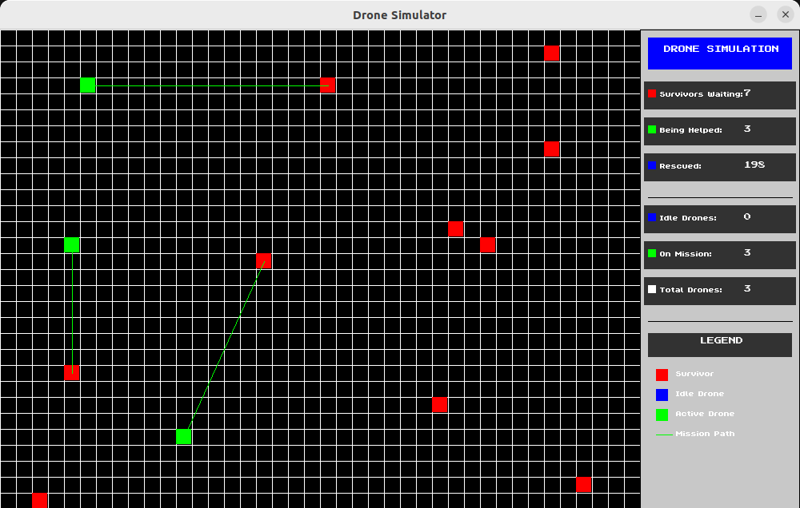
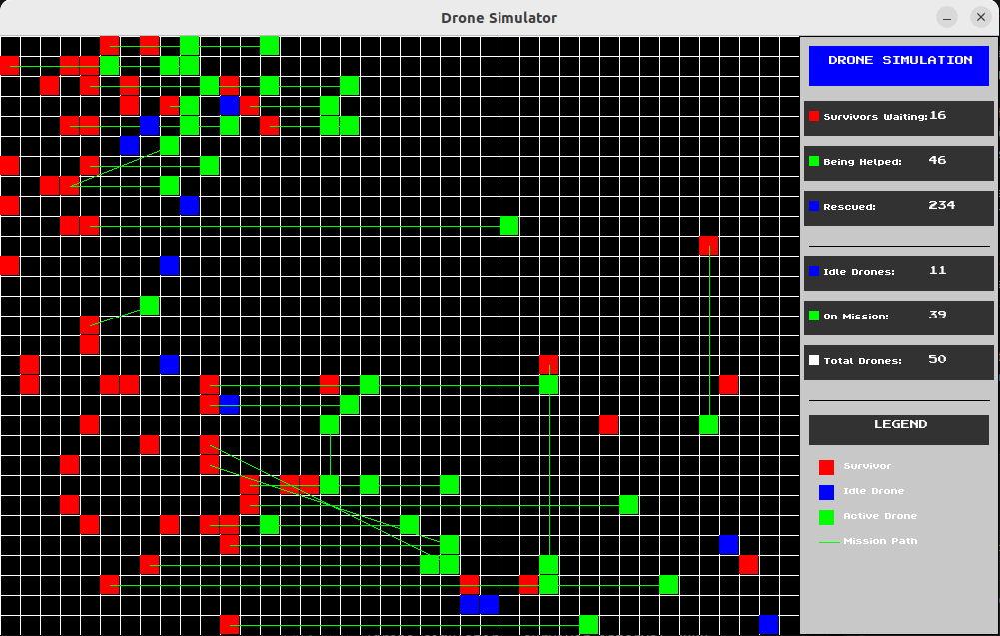
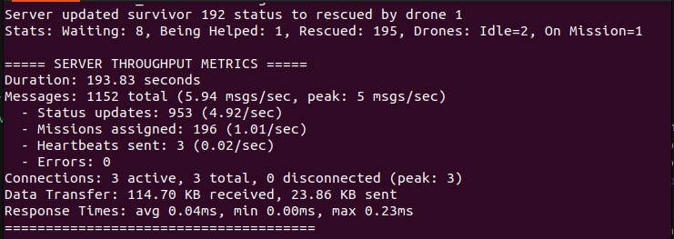

# **Emergency Drone Coordination System**

## **Overview**
The Emergency Drone Coordination System is a sophisticated multi-threaded client-server application designed for coordinating autonomous drone fleets during emergency response situations. The system enables efficient resource allocation by dispatching drones to survivors in disaster zones using distance-optimized algorithms and real-time communications.



## **Key Features**
- **🤖 AI-Driven Mission Assignment**: Optimized drone-to-survivor matching using proximity calculations
- **🌐 Client-Server Architecture**: TCP/IP-based communication with JSON messaging protocol
- **📊 Real-time Visualization**: SDL2-based graphical interface with color-coded entities
- **⚡ High Performance**: Supports 50+ simultaneous drone connections and 1000+ survivors
- **🔒 Thread Safety**: Comprehensive synchronization with mutex protection and deadlock prevention
- **📈 Performance Monitoring**: Real-time metrics tracking response times, throughput, and resource utilization

## **System Architecture**
The system is built around three main components:

### **Server Component**
The central coordination server manages the emergency response operation:
- Multi-threaded architecture for concurrent drone connections
- Advanced survivor tracking with spatial indexing
- AI controller for intelligent mission assignment
- Thread-safe data structures for reliable coordination
- Performance monitoring with real-time statistics

### **Client Component**
Autonomous drone clients connect to the server and perform rescue missions:
- TCP/IP-based communication with the coordination server
- Automatic status reporting and mission execution
- Path planning for efficient navigation
- Fault-tolerant operation with connection management

### **Visualization System**
Real-time graphical representation of the emergency response scenario:
- Color-coded display: survivors (red), idle drones (blue), active missions (green)
- Dynamic map updating as missions progress
- Performance statistics dashboard



## **Technical Implementation**

### **Communication Protocol**
A lightweight JSON-based protocol enables efficient server-client interaction:
- **Drone → Server**: Status updates, mission completions
- **Server → Drone**: Mission assignments, heartbeat messages
- See [communication protocol details](communication-protocol.md) for complete specifications

### **Multi-Threading Model**
The system uses a carefully designed threading architecture:
- One thread per connected drone for message handling
- Dedicated threads for AI control, survivor generation, and performance monitoring
- Main thread handles visualization and user interaction

### **Synchronization Strategy**
Thread safety is ensured through a comprehensive synchronization approach:
- Per-list mutex protection for shared data structures
- Fine-grained locking to maximize concurrency
- Semaphore-based flow control for list operations
- Strict locking hierarchy to prevent deadlocks



---

### **Phased Implementation Plan**  
#### **Phase 1 (given as a lab): Thread-Safe Lists & Simulated Clients/Servers**  
**Objective**: Implement synchronization and simulate client-server interactions using threads **(no sockets yet, drones are simulated as threads)**.  
**Duration**: 1 week  
 
In the lab you will implement the synchronized lists necessary for the project. For instance, in Java there are conccurent data structures[see the link](https://docs.oracle.com/en/java/javase/11/docs/api/java.base/java/util/concurrent/package-summary.html) they provide thread safe datastructures.

**In this thread safe data structures, you still need to use locks when you try to iterate over them.**  
- You are given a partially implemented simulator. You need to implement synchronizations in the list. And change the lock/unlock mechanism in the simulator code.

**Tasks**:  
1. **Fix and Enhance the List Implementation**:  
   - **Mandatory Fixes**:  
     - Add `pthread_mutex_t` to the `List` struct in `list.h` and synchronize all operations (`add`, `remove`, `pop`).  
     - Fix memory leaks in `destroy()` by removing redundant `memset`.  
     - Replace `sprintf` with `snprintf` in `listtest.c` to prevent buffer overflows. 
     - Remove unnecessary locks/unlocks
       - use only in iterations(next etc) 
   - **Optional Efficiency Improvements**:  
     - Implement a *free list* to reuse nodes and reduce allocation overhead.

2. **Simulate Drones and Survivors with Threads**:  
   - **Drone Simulator Thread**:  
     ```c  
      void* drone_behavior(void *arg) {
          Drone *d = (Drone*)arg;
          
          while(1) {
              pthread_mutex_lock(&d->lock);
              
              if(d->status == ON_MISSION) {
                  // Move toward target (1 cell per iteration)
                  if(d->coord.x < d->target.x) d->coord.x++;
                  else if(d->coord.x > d->target.x) d->coord.x--;
                  
                  if(d->coord.y < d->target.y) d->coord.y++;
                  else if(d->coord.y > d->target.y) d->coord.y--;

                  // Check mission completion
                  if(d->coord.x == d->target.x && d->coord.y == d->target.y) {
                      d->status = IDLE;
                      printf("Drone %d: Mission completed!\n", d->id);
                  }
              }
              
              pthread_mutex_unlock(&d->lock);
              sleep(1); // Update every second
          }
          return NULL;
      } 
     ```  
   - **Survivor Generator Thread**:  
     ```c  
     void* survivor_generator(void* arg) {  
         while (1) {  
             // Generate random survivors  
             // Add to synchronized `survivor_list`  
             sleep(2);  
         }  
     }  
     ```  

3. **Visualize with SDL**:  
   - Update `view.c` to show:  
     - Survivors as **red cells**, idle drones as **blue dots**, and missions as **green lines**.  

---

#### **Phase 2: Basic Socket Communication**  
see [communication protocol details](communication-protocol.md)

**Objective**: Replace simulated threads with real socket-based clients and servers.  
**Duration**: 1 week (after socket lectures)  

**Tasks**:  
1. **Server Implementation**:  
   - Create a multi-threaded server that:  
     - Listens for incoming drone connections (TCP).  
     - Maintains a synchronized list of active drones and survivors.  
   - Example server loop:  
     ```c  
     while (1) {  
         int drone_fd = accept(server_fd, (struct sockaddr*)&client_addr, &addr_len);  
         pthread_create(&thread_id, NULL, handle_drone, (void*)&drone_fd);  
     }  
     ```  

2. **Drone Client Implementation**:  
   - Drones connect to the server and send periodic status updates (JSON format):  
     ```json  
     { "drone_id": "D1", "status": "idle", "location": [10, 20] }  
     ```  
   - Receive mission assignments (e.g., `{"type": "mission", "target": [x, y]}`).  

3. **AI Controller Logic**:  
   - Assign closest idle drone to the oldest unhelped survivor (prioritize fairness).  

---

#### **Phase 3: Advanced Features & Testing**  
**Objective**: Optimize performance and handle edge cases.  
**Duration**: 1 week  

**Tasks**:  
1. **Load Testing**:  
   - Simulate 50+ drones and measure server throughput.  
2. **Fault Tolerance**:  
   - Handle disconnected drones (e.g., reassign missions after timeout).  
3. **Optional Extensions**:  
   - Add a web-based dashboard using WebSocket for real-time monitoring.
     - Or you can use view.c as a client version
     - Server sends the changes to the client or the whole data and client shows it
   - Implement QoS (quality of service) e.g., prioritize critically injured survivors.  

---

### **Documentation Generation**
The project uses Doxygen to generate comprehensive documentation. Follow these steps to generate updated documentation:

#### **Prerequisites**
- Install Doxygen: `sudo apt-get install doxygen` (Ubuntu/Debian)

#### **Generating Documentation**
1. **Basic Generation**:
   ```bash
   # Generate from the project root
   doxygen Doxyfile
   ```
   This will create/update HTML documentation in the `docs/html` directory

2. **Viewing Documentation**:
   - HTML: Open `docs/html/index.html` in your browser

3. **Documentation Structure**:
   - **Main Page**: Overview, features, and architecture
   - **Modules**: Logical groups of related functionality
   - **Classes**: Data structure documentation with relationships
   - **Files**: Source code documentation with dependencies
   - **Examples**: Usage examples and test cases

---

### **Building and Running the System**

#### **Compilation**
1. **Build all components at once**:
   ```bash
   # Build the entire system (server, client, and tests)
   make all
   ```

2. **Build specific components**:
   ```bash
   # Build just the server component
   make drone_simulator

   # Build just the client component
   make drone_client

   # Build test utilities
   make tests
   ```

#### **Running the System**

1. **Start the coordination server**:
   ```bash
   # Launch the server (must be started first)
   ./drone_simulator
   ```
   This launches the central coordination server with SDL visualization. The server will display a map showing drones, survivors, and ongoing missions.

2. **Connect a single drone client**:
   ```bash
   # Launch a single drone client that connects to the server
   ./drone_client
   ```
   Each client will automatically connect to the server and begin accepting missions.

3. **Launch multiple drone clients simultaneously**:
   ```bash
   # Launch 50 drone clients in the background
   ./tests/launch_drones.sh
   ```
   The script creates multiple client instances that connect to the local server, enabling large-scale testing of the coordination system.

#### **Monitoring and Debugging**

- View real-time performance metrics in the terminal during server execution
- Check CSV output logs in the project directory for detailed performance analysis
- The final performance metrics in json format are written automatically in files in the project directory
- Use `Ctrl+C` to gracefully shut down the server and get final statistics


---
````
